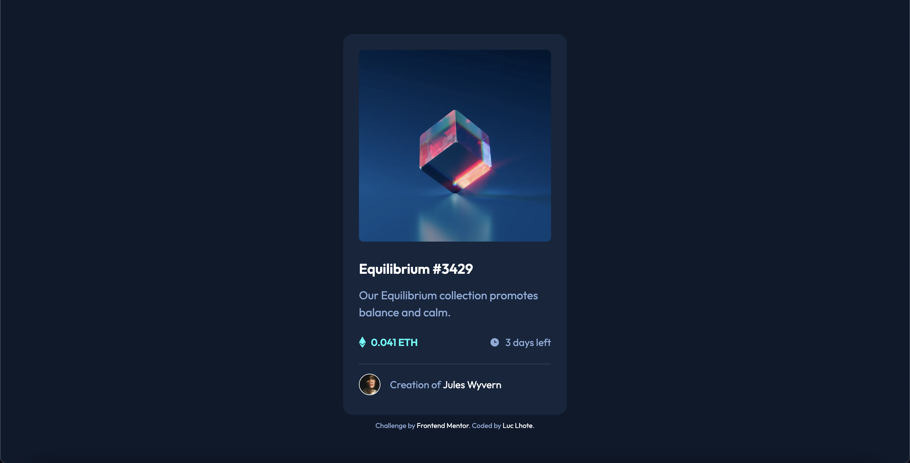

# Frontend Mentor - NFT preview card component solution

This is a solution to the [NFT preview card component challenge on Frontend Mentor](https://www.frontendmentor.io/challenges/nft-preview-card-component-SbdUL_w0U). Frontend Mentor challenges help you improve your coding skills by building realistic projects. 

## Table of contents

- [Overview](#overview)
  - [The challenge](#the-challenge)
  - [Screenshot](#screenshot)
  - [Links](#links)
- [My process](#my-process)
  - [Built with](#built-with)
- [Author](#author)

## Overview

### The challenge

Users should be able to:

- View the optimal layout depending on their device's screen size
- See hover states for interactive elements

### Screenshot

### Links

- Solution URL: [https://github.com/LucLhote/FrontendMentor-NFT-preview-card-component-challenge](https://github.com/LucLhote/FrontendMentor-NFT-preview-card-component-challenge)
- Live Site URL: [https://luclhote.github.io/FrontendMentor-NFT-preview-card-component-challenge/](https://luclhote.github.io/FrontendMentor-NFT-preview-card-component-challenge/)

## My process

### Built with

- Semantic HTML5 markup
- CSS custom properties
- Flexbox
- Mobile-first workflow
- JavaScript
- [BEM](http://getbem.com/) - Block Element Modifier

## Author

- Email - [luc.lhote@outlook.com](luc.lhote@outlook.com)
- Frontend Mentor - [@LucLhote](https://www.frontendmentor.io/profile/LucLhote)
- LinkedIn - [Luc Lhote](https://www.linkedin.com/in/luclhote/)
- freeCodeCamp - [@LucLh](https://www.freecodecamp.org/LucLh)
- freeCodeCamp Forum - [@LucLh](https://forum.freecodecamp.org/u/luclh/summary)
